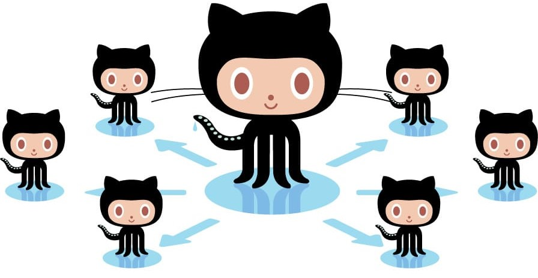

#  || GitHub is socially very popular because of its network ||

#  || Information ||
* GitHub is a Git repository hosting service, but it adds many of its own features.
* While Git is a command line tool, GitHub provides a Web-based graphical interface. 
* It also provides access control and several collaboration features, such as a wikis and basic task management tools for every project.

# || Different type of language used in GitHub ||
# * JavaScript:-
   JavaScript has always been the most loved language by the developers
# * Python

# * Java
# * PHP
# * Typescript
# * Shell

#  ==========================================
# Emotes of some GitHub 

